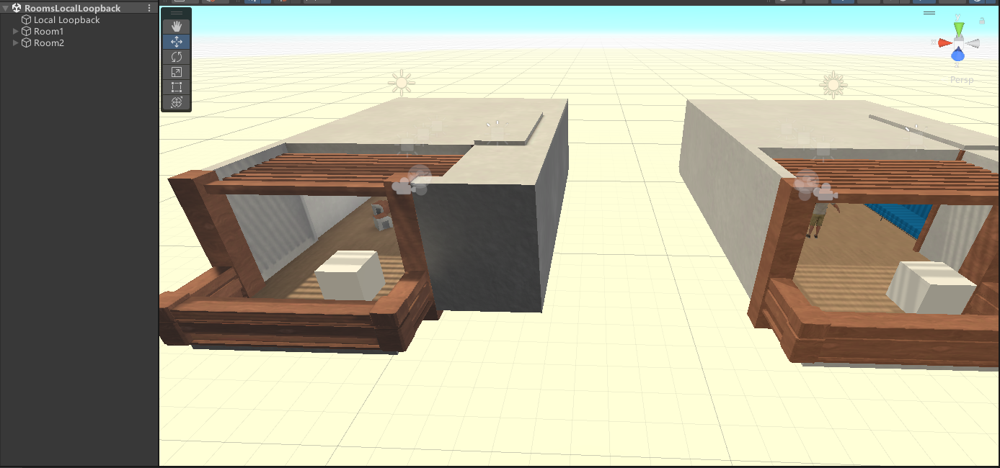
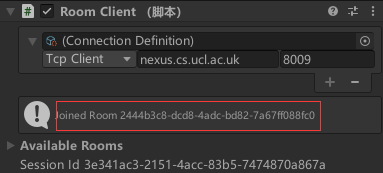
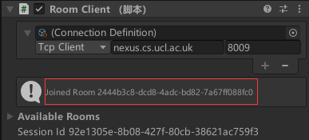

## 《分布式虚拟现实中化身的影响》工程文件与脚本代码
**陈泽越 519021910644**

### 1. Ubiq文件夹
Ubiq文件夹中为使用到的Ubiq脚本，包含自行编写的
`MyNetworkedObject.cs`、`JoinRoomClients.cs`
基于Ubiq基础脚本的
`NetworkScene.cs`、`RoomClient.cs`、`LatencyMeter.cs`、`VoipPeerConnectionManager.cs`、`LogCollector.cs`、`RoomSceneManager.cs`

`MyNetworkedObject.cs`：游戏对象网络化脚本，定义了包含对象位置与旋转信息的消息，用于接收消息、更新对象状态、传递消息，实现对象的状态同步。

`JoinRoomClients.cs`：在Local Loopback场景（在同一Unity场景中建立两个房间视作两个客户端）中，在开始时将两个客户端加入同一房间。

`NetworkScene.cs`：将网络化组件连接到网络上。

`RoomClient.cs`：设定房间客户端，使客户端可以通过房间服务器加入、离开房间。

`LatencyMeter.cs`：同其他peer上的组件一同工作测量并记录延迟。

`VoipPeerConnectionManager.cs`：管理语音连接信道的lifetime。

`LogCollector.cs`：接收管理日志信息。

`RoomSceneManager.cs`：管理房间场景，在加入离开房间时进行管理。

 

### 2. Gobang文件夹
Gobang文件夹为五子棋游戏相关文件，包含游戏脚本`chess.cs`以及棋盘棋子贴图。

 

### 3. VRIK文件夹
VRIK文件夹包含化身驱动脚本`VRIK.cs`以及`FinalIK`和`HurricaneVR`的Unity包。

 

### 4. 工程文件
`SocialDVR.zip`为Unity工程文件压缩包，其中包含`RoomsLocalLoopback`场景，在同一Unity场景中建立两个独立房间模拟两个客户端，如下图

场景中包含`Room1`和`Room2`代表两个客户端，开始后两个客户端会自动加入同一房间，如图

房间中有两个客户端分别对应的化身，立方体对象等，均为网络化对象，可以在该场景中看到它们的状态在两客户端间同步。Room1的化身由VRIK驱动，可通过Oculus rift s设备操控。

\
其中已经导入`Ubiq 0.4.5`, `Oculus XR Plugin 3.2.3`, `Oculus Intergration 53.0`, `FinalIK2.2`, `Home Kit: VRChat SDK Template 1.0`

\
`RoomsLocalLoopback.unitypackage`则为在Unity导出而成的资源整合包。
